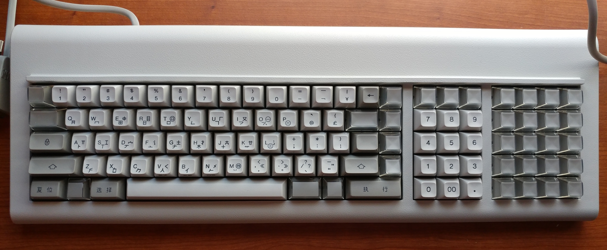
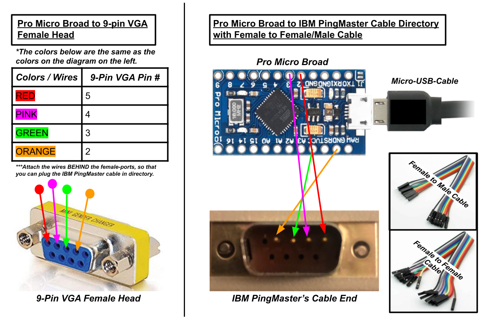
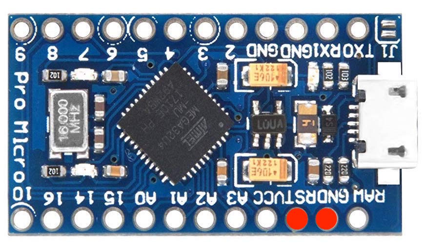

# IBM_PingMaster-Converter
- Mehmet Yilmaz

  
  <em>https://imgur.com/gallery/ljxUiev</em>

## What is the IBM PingMaster?
- The IBM PingMaster is a keyboard made by IBM during the 1980s for the Chinese and Japanese market. This keyboard uses vintage green switches and has a strange connection cable that is like a 9-pin VGA cable but with only 4-pins. Also, this keyboard has built in speakers and a volume numb for that speaker which allows you to determine the volume of the speaker as well as allow the keyboard to beep every time you hit a key. I have no idea why this beeping feature was made, but its unique and different. To learn more about this keyboard, just Google it or check out this video by Chyrosran22: https://www.youtube.com/watch?v=LfyOs694lpU.

## About:
- What type of converter is this?
  - This converter is a converter that converts the 4 pins of the IBM PingMaster keyboard into a USB output. This allows the user to use an IBM PingMaster keyboard with any modern computer.
- The goal of this probject was the make the converter described above. To do this, I want though a good about of sources and troubleshooting. To help anyone in the future that wants to do this project, I wrote about my process of making this coverter as well as list the sources I used to help me achieve this goal. Without the internet, I have no idea how i could have made this converter.

## Special Thanks:
- I would like to give special thanks to MrKeebs. His YouTube Video, linked below, really helped with making this converter. It was a really good tutorial but I did struggle with the section where you had to upload a HEX file to the PingMaster, but it was really helpful with the wiring.
  - Link: https://www.youtube.com/watch?v=lIQO2AhBs8Q 
- *In the description of MrKeebs YouTube video, there is a link to his Discord Server. This Discord was really helpful when it came to debugging my issues making the converter, so please checkout this server and ask for help if you need it.*

## Required Hardware:
  1) IBM PingMaster Keyboard
  2) Pro Micro Board
  3) Wires or female to female/male cables
  4) (optional) 9-Pin VGA Female Head

## Required Software (not much):
  1) QMK ToolBox
  2) *a web browser*

## Steps:
1) Wire up the Pro Mircro Board. You can wire it directly to the cable's pin using female to female/male cables or by using a 9-pin VGA Female Head. Look at the diagram below to for the wiring:

  

2) After wiring everything up, create your Hex file. This hex file will be the layout of the keyboard which you can design though the following website: http://www.tmk-kbd.com/tmk_keyboard/editor/unimap/?ibm4704_usb_rev1_alps. So basically design you layout though this website, then download it.

3) When you have your file's layout, you need to upload the file to the Pro Micro Board. To do this, download and set up a tool called QMK ToolBox from the following GitHub link: https://github.com/qmk/qmk_toolbox. 

4) When the QMK ToolBox is setup, click the *open* and go to the directory of the Hex file you downloaded from step 2. Underneath the Microcontroller text, select atmega32u4. It might be different for you, so you might have to check what your micrcocontroller is though the terminal. Check out the Useful Links if you get confused.

5) Before doing this step, dont connect your IBM PingMaster to your Pro Micro Board yet and read all of step 5 before doing it. After getting everything setup, plug your Pro Micro Board (from the micro usb cable) into your computer with the QMK Toolbox running. Then immediately reset your Pro Micro Board by short circuiting the board. To reset it, please look at the diagram below or SparkFun linked listed in *Useful links*. After reseting it, you MUST immediately hit the FLASH button in QMK Toolbox. If this works, you should get a *successful* message of some short. If this does not work. Redo step 5 again. If it keeps failing, please check out the *Useful links* below.

  

6) After step 5, connect your IBM PingMaster to your converter.

7) Then, test your converter by raising the keyboard's volume nob and typing. Make sure that the speaker works when you type. Also, visit the following website to test and make sure all the keys work: http://keyboardchecker.com/.

8) Finally, after finishing all the steps, enjoy your IBM PingMaster!

★ If there are any errors/issues with this tutorial, please write about in the issue section for this repository. I am new to all this stuff so I most likly made a mistake somewhere.

## Sources and Useful links That I used:
- Here is a link to the MrKeebs YouTube video, in case you missed it earlier:
  - https://www.youtube.com/watch?v=lIQO2AhBs8Q

- Here is a good keycap testing website: http://keyboardchecker.com/

- Here is a good YouTube tutorial, for using QMK ToolBox that might be useful and the GitHub link for QMK ToolBox:
  - https://www.youtube.com/watch?v=VR53Wo9Z960
  - https://github.com/qmk/qmk_toolbox

- Here is a guide by SparkFun for how to reset the Pro Micro Board:
  - https://learn.sparkfun.com/tutorials/pro-micro--fio-v3-hookup-guide/troubleshooting-and-faq

- Here is the link to the TMK Keymap Editor for the IBM PingMaster layout:
  - http://www.tmk-kbd.com/tmk_keyboard/editor/unimap/?ibm4704_usb_rev1_alps

- Here is the eBay Seller that I bought the IBM PingMaster from during the Spring of 2019:
  - https://www.ebay.com/itm/IBM-Chinese-Lettering-Keyboard-Typing-102-Keyboard-Letter-Type-Model-6113442-NIB-/381019318430

- Some good keyboard dicussion groups and keyboard contact creaters:
  - Dicussion: https://geekhack.org/index.php?PHPSESSID=lqmg2ap4h7trgpdsgm9stlh10jf7i58d& , https://www.reddit.com/r/MechanicalKeyboards/ ,
  - YouTube: https://www.youtube.com/user/Chyrosran22 , https://www.youtube.com/channel/UCllGwtW6scxAjM28fIgEozg , https://www.youtube.com/user/FeelgHoodMusic
